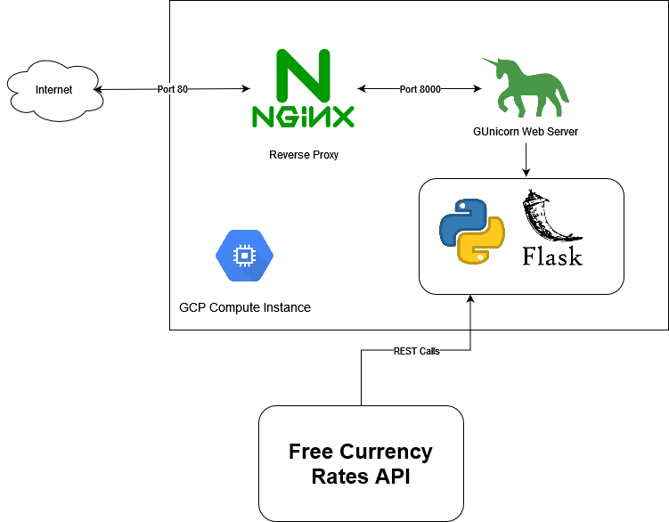

# currency-converter

# Design



Currency converter is a simple web application that shows the exchange rates between currencies given a date. The app is written in python and uses the MTV(Model-Template-View) pattern. The *Model* is stored in [model.py](model.py). It makes use of [Free Currency Rates API](https://github.com/fawazahmed0/currency-api) to fetch a list of currencies and their exchange rates using the Euro as base. This API was chosen as it is free, easy to work with and requires no sign-up. However, currency data are sometimes uploaded late and thus recent exchange rates may not be available. The front end uses Flask, a lightweight web framework that is used for templating, ([templates folder](/templates/home.html)) and manages the [view](app.py).

The app is deployed within a GCP VM Instance and is accessible via HTTP port 80. Within the VM instance, the application is ran using the production-grade web-server GUnicorn. The webpages are served behind an Nginx reverse proxy. The main reason for the setup is for security but it also simplifies the application deployment to port 80.

# Development

## Prerequisites
```
# python3 and pip has to be installed first

# (optional) virtualenv lets you put pip installations and environment variable exports in a sandbox 
pip install virtualenv

# the web framework
pip install flask
```

## Initialization and running locally
```
# you can choose a different name other than env here
virtualenv env
FLASK_APP=app.py

# running the application
flask run
```

# Deployment

The application may be deployed using several means but we will use a VM Instance of Ubuntu 18.10

## Start Up

First of all, copy the repository to an accessible dir in the VM Instance using Git or by manually copying the files. Then, execute the following:
```
# install the dependencies
sudo apt-get update
sudo apt-get install python3-pip gunicorn3 nginx -y
pip3 install flask

# navigate to the repository files

# start gunicorn where the first 'app' is the name of the file in app.py and the second 'app' is the flask instance within
gunicorn -D app:app

# replace the contents of the /etc/nginx/available-sites/default with the contents of default
sudo rm /etc/nginx/available-sites/default
cp /etc/nginx/available-sites/default default

# restart nginx
sudo service nginx restart
```